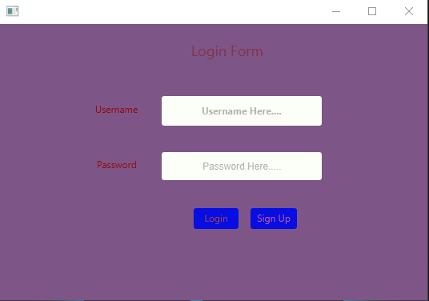
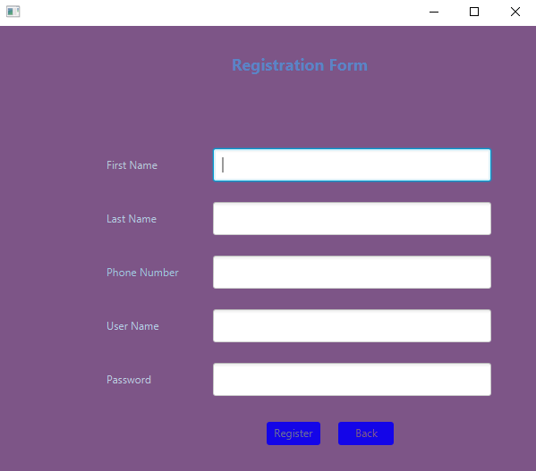
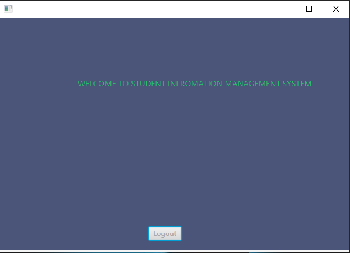

# JavaFXLoginForm

---

## Sample screenshots from the Login Form

<br>

<br>

<br>

## Requirements

- JDK - 17.0.2
- JavaFX SDK - 17.0.2
- mysql-connector-java-8.0.29

## vmArgs Setup

```
--module-path /path/to/javafx-sdk-17.0.2/lib --add-modules javafx.controls,javafx.media
```
